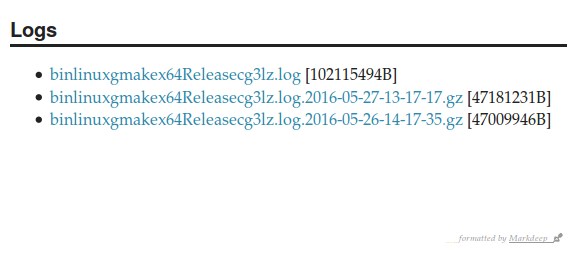
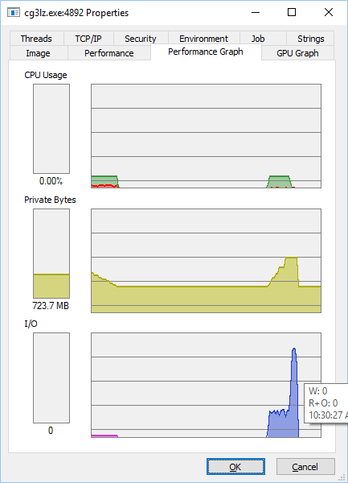
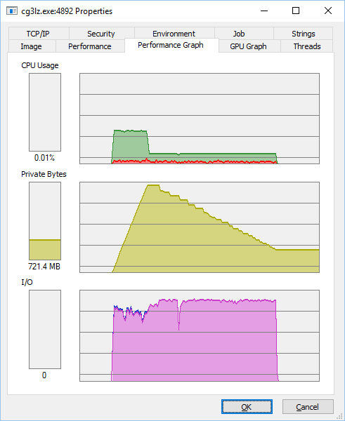

# crow + g3log + 0mq + markdeep + mstch == a simple log server #

[](https://travis-ci.org/d-led/crow_g3log_zmq)

> no warranties / use at your own risk

Used in the project

- [premake5](https://premake.github.io/) a meta-build generator used with some [patterns](https://github.com/d-led/premake-meta-cpp)
- [crow](https://github.com/ipkn/crow) is a C++11 micro web framework
- [g3log](https://github.com/KjellKod/g3log) is an asynchronous logging library
- [ØMQ](http://zero.mq/) is a set of communication protocols their implementations for the XXI century
- [markdeep](https://casual-effects.com/markdeep/) as the markdown-based front-end
- [mstch](https://github.com/no1msd/mstch/) for rendering [{{ mustache }}](https://mustache.github.io/)-based templates

This project is a hommage to the aforementioned libraries. Its own feature set is arbitrary and will grow at will, but it builds upon the tiny giants mentioned above.

If the speed of the incoming log messages is larger than that of the log sink, the used memory will grow until the process crashes. When all messages are committed, the memory footprint will decrease again.

<!-- [](https://travis-ci.org/d-led/crow_example) -->

## Log via HTTP ##

using [httpie](http://httpie.org):

```
echo "bla\c" | http put http://localhost:18080/log
```

## Log via 0mq ##

i.e. in Python:

```python
#!/usr/bin/env python
import zmq

context = zmq.Context()
push = context.socket(zmq.PUSH)
server = "localhost"
push.connect("tcp://"+server+":18090")
push.send("bla")
```

## Toggle console logging of Crow ##

```
http get http://localhost:18080/toggle_logging
```

## Stop the server (rather) gracefully ##

```
http get http://localhost:18080/kill
```

## Download the logs ##

Open [http://localhost:18080](http://localhost:18080) in the browser. Download the listed log files.

Example view:



## Source ##

- [cg3lz (server)](src/main.cpp)
- [log_some](src/log_some.py)
- [build config](premake5.lua)
- [demo](src/demo.rb)

## Building and starting ##

### On Linux ###

```
d-led@ubuntu:~/src/crow_g3log_zmq$ make -C Build/linux/gmake/ config=release_x64 && \
 bin/linux/gmake/x64/Release/cg3lz
make: Entering directory '/home/dled/src/crow_g3log_zmq/Build/linux/gmake'
==== Building g3log (release_x64) ====
==== Building mstch (release_x64) ====
==== Building g3sinks (release_x64) ====
==== Building cg3lz (release_x64) ====
main_page.cpp
Linking cg3lz
==== Building log_some (release_x64) ====
make: Leaving directory '/home/dled/src/crow_g3log_zmq/Build/linux/gmake'
cg3lz Listening to 0mq incoming logs on: tcp://*:18090
cg3lz Saving logs to: logs/
cg3lz (2016-05-27 20:33:41) [INFO    ] Crow/0.1 server is running, local port 18080
cg3lz (2016-05-27 20:33:41) [DEBUG   ] Connection open, total 1, 0x1a349f0
```

<!--
813008/s, total: 100000
452489/s, total: 200000
117096/s, total: 300000
182149/s, total: 400000
154321/s, total: 500000
132450/s, total: 600000
134953/s, total: 700000
134953/s, total: 800000
253165/s, total: 900000
156006/s, total: 1000000
138313/s, total: 1100000
200000/s, total: 1200000
90497.7/s, total: 1300000
135685/s, total: 1400000
228311/s, total: 1500000
134953/s, total: 1600000
... -->

### On Windows ###

open `Build\vs2015\cg3lz.sln` and build.

Boost expected at `D:\Software\boost\boost_1_61_0` with libraries in `lib32-msvc-14.0` and `lib64-msvc-14.0`.

### Regenerating the build scripts ###

See the premake build config and premake documentation

## Commentary ##

The implementation is naive at the moment, and might potentially interfere with the log rotation mechanism.

Download 600mb:



Burst logging:



